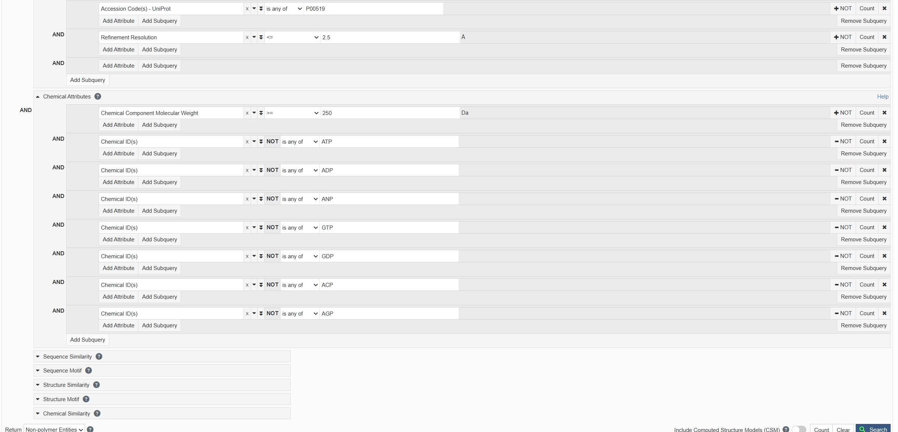
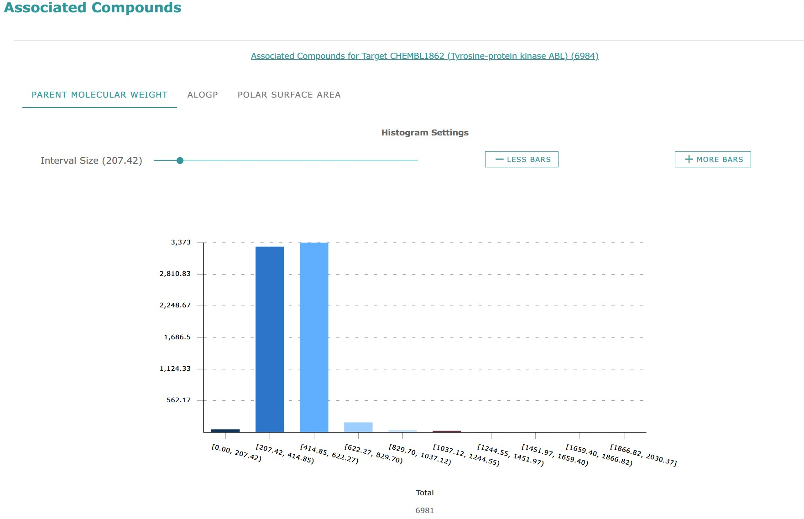
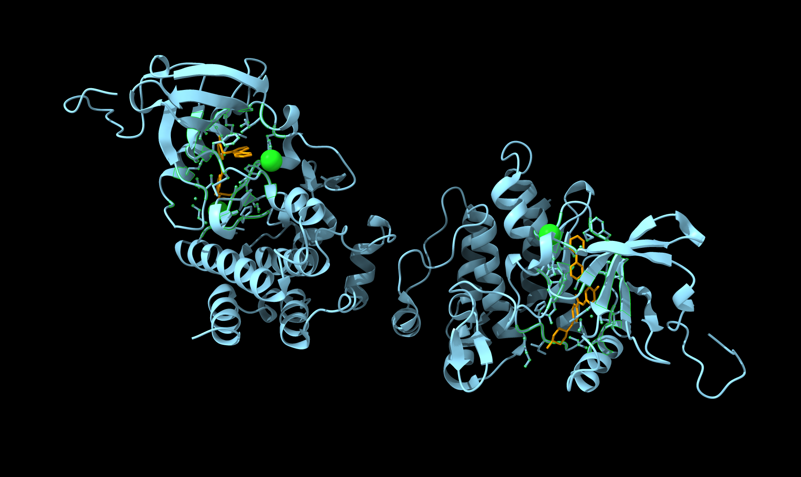

# Computational Biology Homework 2

## Q1

Using the following requirements in the "advanced search" in PDB database:



The ligand report is saved as "q1.csv".

## Q2

Organize the data in the report, leaving three columns of Entry ID (renamed to PDB_ID), Ligand ID (renamed to Ligand_ID) and Ligand SMILES (renamed to SMILES).

Use the following code to generate two fingerprints.

```python
from rdkit import Chem
from rdkit.Chem import MACCSkeys
from rdkit.Chem import AllChem
import pandas as pd

def generate_fingerprints_from_csv(input_csv_path="q2-start.csv", output_excel_path="abl1_ligand_fingerprints_from_csv.xlsx"):
    results = []
    df_input = pd.read_csv(input_csv_path)

    for index, row in df_input.iterrows():
        pdb_id = row["PDB_ID"]
        ligand_id = row["Ligand_ID"]
        smiles = row["SMILES"]

        mol = Chem.MolFromSmiles(smiles)
        fp_maccs = MACCSkeys.GenMACCSKeys(mol)
        fp_maccs_binary = fp_maccs.ToBitString()
        fp_ecfp4 = AllChem.GetMorganFingerprintAsBitVect(mol, radius=2, nBits=1024)
        fp_ecfp4_binary = fp_ecfp4.ToBitString()

        results.append({
            "PDB-ID": pdb_id,
            "Ligand-ID": ligand_id,
            "SMILES": smiles,
            "MACCS_Binary": fp_maccs_binary,
            "ECFP4_Binary": fp_ecfp4_binary
        })

    df_results = pd.DataFrame(results)
    print(f"\nProcessed {len(df_results)} ligands.")
    if not df_results.empty:
        print(df_results.head())
    df_results.to_excel(output_excel_path, index=False)
    print(f"\nSuccessfully saved data to {output_excel_path}")

if __name__ == "__main__":
    generate_fingerprints_from_csv(input_csv_path="./hw2/q2-start.csv",
                                   output_excel_path="./hw2/q2_output.xlsx")
```

The result is saved as "q2_output.xlsx".

## Q3

Use the following code to group the ligands. The result is saved as "q3.xlsx".

```python
import pandas as pd
from rdkit import Chem
from rdkit.Chem import DataStructs
from rdkit import DataStructs

def binary_string_to_bitvect(binary_string):
    if not isinstance(binary_string, str) or not all(c in '01' for c in binary_string):
        return None
    bv = DataStructs.ExplicitBitVect(len(binary_string))
    for i, bit in enumerate(binary_string):
        if bit == '1':
            bv.SetBit(i)
    return bv

def cluster_ligands(df, fingerprint_column_name, id_column_name, cutoff):
    num_ligands = len(df)
    if num_ligands == 0:
        return []
    fingerprints = []
    valid_indices = []
    for i, fp_str in enumerate(df[fingerprint_column_name]):
        bv = binary_string_to_bitvect(fp_str)
        if bv:
            fingerprints.append(bv)
            valid_indices.append(i)
    if not fingerprints:
        return ["No_Valid_FP"] * num_ligands

    group_assignments = ["Unclustered_Invalid_FP"] * num_ligands
    temp_group_assignments = [-1] * len(fingerprints)
    cluster_id_counter = 0
    for i in range(len(fingerprints)):
        if temp_group_assignments[i] == -1:
            temp_group_assignments[i] = cluster_id_counter
            leader_fp = fingerprints[i]
            for j in range(i + 1, len(fingerprints)):
                if temp_group_assignments[j] == -1:
                    similarity = DataStructs.TanimotoSimilarity(leader_fp, fingerprints[j])
                    if similarity >= cutoff:
                        temp_group_assignments[j] = cluster_id_counter
            cluster_id_counter += 1
    for i, temp_idx in enumerate(valid_indices):
        group_assignments[temp_idx] = f"Group_{temp_group_assignments[i]}"
    return group_assignments

if __name__ == "__main__":
    input_excel_path = "./hw2/q2_output.xlsx"
    output_excel_path = "./hw2/q3.xlsx"
    fp_column_to_use = 'ECFP4_Binary'
    ligand_id_column = 'Ligand-ID'
    df_ligands = pd.read_excel(input_excel_path)

    # --- Clustering with Tanimoto cutoff = 0.5 ---
    df_ligands['Group_T0.5'] = cluster_ligands(df_ligands, fp_column_to_use, ligand_id_column, 0.5)
    print("Clustering with Tanimoto cutoff = 0.5 finished.\n")
    # --- Clustering with Tanimoto cutoff = 0.3 ---
    df_ligands['Group_T0.3'] = cluster_ligands(df_ligands, fp_column_to_use, ligand_id_column, 0.3)
    print("Clustering with Tanimoto cutoff = 0.3 finished.\n")

    print("--- Ligand Clustering Results ---")
    df_ligands.to_excel(output_excel_path, index=False)
    print(f"\nSuccessfully saved clustered ligand data to {output_excel_path}")
    print("\n--- Group Counts (Tanimoto Cutoff = 0.5) ---")
    print(df_ligands['Group_T0.5'].value_counts().sort_index())
    print("\n--- Group Counts (Tanimoto Cutoff = 0.3) ---")
    print(df_ligands['Group_T0.3'].value_counts().sort_index())
```

## Q4

### 4.1

Search "human tyrosine-protein kinase ABL" in the ChEMBL. The ChEMBL Target ID is CHEMBL1862.  
Check the "[Associated Compounds](https://www.ebi.ac.uk/chembl/explore/target/CHEMBL1862#AssociatedCompounds)". There are 6984 tested compound.



### 4.2

$$
\text{pChEMBL Value} = -\lg \text{IC50}
$$

For $\text{IC50} \leq 0.1 \text{nM}$, its $\text{pChEMBL Value} \geq 10$.

Use the following code to filter the compounds. The result is saved as "q4.xlsx".

```python
from chembl_webresource_client.new_client import new_client
import pandas as pd

activity = new_client.activity
target_chembl_id = 'CHEMBL1862'
pchembl_threshold = 10
res = activity.filter(
    target_chembl_id=target_chembl_id,
    standard_type__iexact="IC50",
    pchembl_value__gte=pchembl_threshold,
    pchembl_value__isnull=False,
    assay_type__in=['B', 'F']
).only(
    'molecule_chembl_id', 'standard_type', 'standard_relation', 'standard_value', 'standard_units',
    'pchembl_value', 'assay_chembl_id', 'assay_description', 'document_chembl_id', 'target_organism'
)

activities_list = list(res)
if activities_list:
    df_activities = pd.DataFrame(activities_list)
    output_filename = "./hw2/q4.csv"
    df_activities.to_csv(output_filename, index=False)
    print(f"\nFull results saved to {output_filename}")
else:
    print("No activities found matching the specified criteria.")
```

## Q5



```sh
open 1IEP
delete solvent
cartoon
select :STI
show :STI atoms
style :STI stick
color protein sky blue
color :STI orange
view :STI
select zone :STI 5 protein
show sel atoms
style sel stick
set bgColor black
lightning full
save ./hw2/q5.png
```
