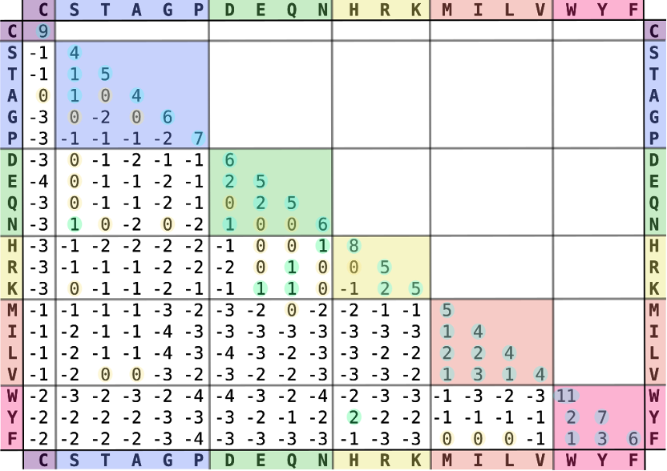

## Q1

Dynamic programming was developed by Richard Bellman in the 1950s. It refers to simplifying a complicated problem by breaking it down into simpler sub-problems in a recursive manner. Sequence alignment is an important application of dynamic programming. Two algorithms, Needleman-Wunsch and Smith-Waterman was developed for global and local sequence alignment.

(1) Please describe the difference between Needleman-Wunsch and Smith-Waterman algorithms.  
(2) What is the time complexity of Smith-Waterman algorithm?  
(3) What is the space (i.e., memory) complexity of Smith-Waterman algorithm?

## Q2

How to make a BLOSUM r matrix? (r is number following BLOSUM. For example, 62.)

## Q3

According to BLOSUM62, which amino acid is the least likely to be mutated? Why?

## Q4

In order to align two sequences that are distant homologs, which matrix is better, BLOSUM45 or BLOSUM80? Why?
