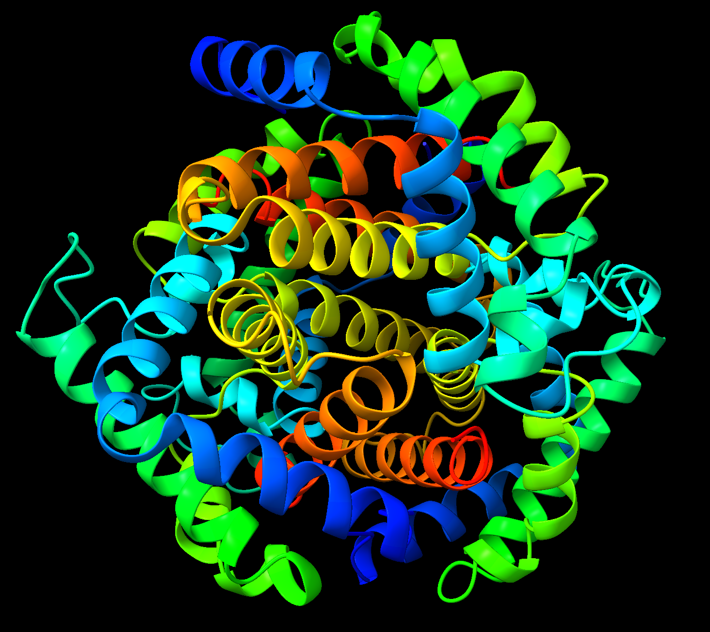

# Computational Biology Homework 7

## Q1

PDB example: 

一级结构：蛋白质的氨基酸线性序列，通过肽键相连  
举例：血红蛋白中的Chain A

二级结构：局部区域氨基酸链的空间排列，主要由氢键稳定  
举例：血红蛋白中的$\alpha$螺旋

三级结构：形成功能域的整条多肽链的三维折叠，由侧链之间的相互作用稳定  
举例：血红蛋白的A链折叠成球形结构

四级结构：多个亚基或多个肽链通过非共价键组装成复合体  
举例：血红蛋白中的两个$\alpha$亚基 (A, C)和两个$\beta$亚基 (B, D)组成四聚体

## Q2

## Q3

## Q4

## Q5

| CASP | Group Name |
| :---: | :---: |
| CASP 16 | Yang-server |
| CASP 15 | Yang-server |
| CASP 14 | AlphaFold 2 |
| CASP 13 | A7D |
| CASP 12 | BAKER |
| CASP 11 | Zhang |
| CASP 10 | |
| CASP 9 | |
| CASP 8 | |
| CASP 7 | |

