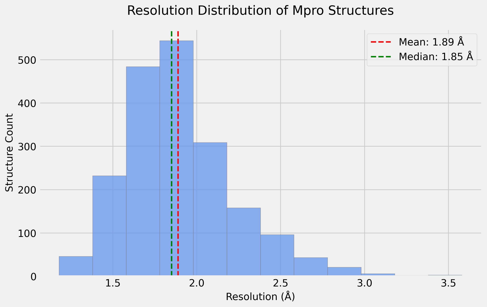
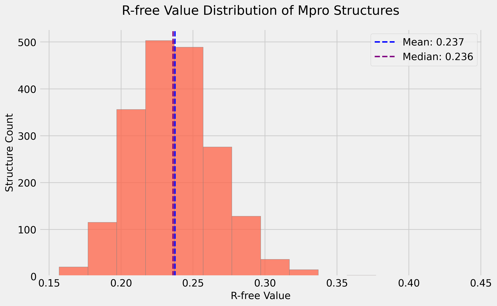
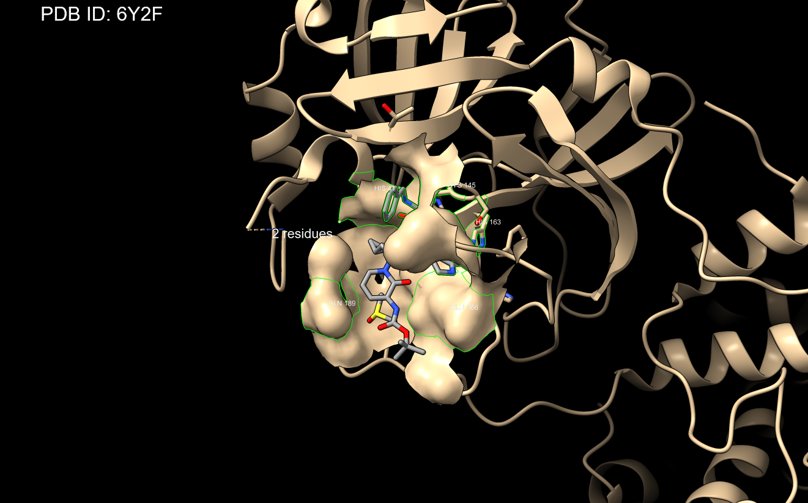

# Computational Biology Project 1

## Task 1

首先在 NCBI Taxonomy 数据库中搜索 11118，选择 genome，并筛选 Assembly Level 为 Scaffold Copmlete，得到结果如下：[result](https://www.ncbi.nlm.nih.gov/datasets/genome/?taxon=11118&assembly_level=1:3)

下载为 `tsv` 文件后根据 Taxon ID 去重，并保存到文件 `q1.xlsx`

去重部分代码如下：

```python
import pandas as pd
def process_coronavirus_data(input_tsv: str, output_excel: str):
    df = pd.read_csv(input_tsv, sep='\t')
    print(f"\nInitial dataset: Total records: {len(df)}; Unique Taxon IDs: {df['Organism Taxonomic ID'].nunique()}")
    df_filtered = df[['Organism Name', 'Organism Taxonomic ID']]
    df_unique = df_filtered.drop_duplicates(subset=['Organism Taxonomic ID'], keep='first')
    df_sorted = df_unique.sort_values(by='Organism Taxonomic ID')
    df_final = df_sorted.reset_index(drop=True)
    df_final.columns = ['Name', 'Taxon ID']
    print(f"\nAfter removing duplicates: Total records: {len(df_final)}; Unique Taxon IDs: {df_final['Taxon ID'].nunique()}")
    df_final.to_excel(output_excel, index=False)

if __name__ == "__main__":
    input_file = "project1/q1/coronavirus_ncbi_dataset.tsv"
    output_file = "project1/q1/q1.xlsx"
    process_coronavirus_data(input_file, output_file)
```

Output:

```
Initial dataset: Total records: 13101; Unique Taxon IDs: 490
After removing duplicates: Total records: 490; Unique Taxon IDs: 490
```

## Task 2

对于有注释的序列和未注释的序列分别采用不同的处理方法，代码如下

```python
from Bio import Entrez
from Bio.Blast import NCBIWWW
import pandas as pd
import time
import os
import json
from datetime import datetime

class MproFinder:
    def __init__(self, email: str, api_key: str | None = None, cache_dir: str = "cache"):
        self.email = email
        self.api_key = api_key
        self.cache_dir = cache_dir
        self.results_dir = "results"
        Entrez.email = email
        Entrez.api_key = api_key
        os.makedirs(cache_dir, exist_ok=True)
        os.makedirs(self.results_dir, exist_ok=True)
        self.reference_mpro = {
            "sequence": """SGFRKMAFPSGKVEGCMVQVTCGTTTLNGLWLDDVVYCPRHVICTSEDMLNPNYEDLLIRKSNHNFLVQA
GNVQLRVIGHSMQNCVLKLKVDTANPKTPKYKFVRIQPGQTFSVLACYNGSPSGVYQCAMRPNFTIKGSF
LNGSCGSVGFNIDYDCVSFCYMHHMELPTGVHAGTDLEGNFYGPFVDRQTAQAAGTDTTITVNVLAWLYA
AVINGDRWFLNRFTTTLNDFNLVAMKYNYEPLTQDHVDILGPLSAQTGIAVLDMCASLKELLQNGMNGRT
ILGSALLEDEFTPFDVVRQCSGVTFQ""",
            "accession": "YP_009725301.1",
            "description": "3C-like proteinase [Severe acute respiratory syndrome coronavirus 2]"
        }
    def _search_annotated_mpro(self, taxon_id: str, virus_name: str) -> tuple[bool, str]:
        cache_key = f"annotated_{taxon_id}"
        if cache_key in self.cache:
            return True, self.cache[cache_key]
        search_terms = [
            f"txid{taxon_id}[Organism] AND (main protease OR 3C-like protease OR 3CLpro OR Mpro)",
            f"txid{taxon_id}[Organism] AND (nsp5 OR pp1a)",
            f"txid{taxon_id}[Organism] AND coronavirus main protease"
        ]
        for term in search_terms:
            try:
                handle = Entrez.esearch(db="protein", term=term, retmax=5)
                record = Entrez.read(handle)
                handle.close()
                if record["Count"] != "0":
                    protein_ids = record["IdList"]
                    handle = Entrez.efetch(db="protein", id=protein_ids[0], rettype="fasta", retmode="text")
                    fasta_record = handle.read()
                    handle.close()
                    return True, fasta_record
                time.sleep(0.34 if not self.api_key else 0.11)
            except Exception as e:
                return False, f"Error in annotated search: {str(e)}"
        return False, "No annotated sequence found"

    def _search_unannotated_mpro(self, taxon_id: str, virus_name: str) -> tuple[bool, str]:
        cache_key = f"blast_{taxon_id}"
        if cache_key in self.cache:
            return True, self.cache[cache_key]
        try:
            handle = Entrez.esearch(db="nucleotide",
                                  term=f"txid{taxon_id}[Organism] AND (complete genome[Title] OR complete sequence[Title])",
                                  retmax=1)
            record = Entrez.read(handle)
            handle.close()

            if record["Count"] == "0":
                return False, "No genome sequence found"
            genome_id = record["IdList"][0]
            print(f"Running BLAST search for {virus_name}...")
            result_handle = NCBIWWW.qblast(
                "tblastn", "nr",
                self.reference_mpro["sequence"],
                entrez_query=f"txid{taxon_id}[Organism]",
                expect=0.001,
                hitlist_size=1
            )
            blast_results = result_handle.read()
            result_handle.close()
            if "No hits found" not in blast_results:
                fasta_record = f">{virus_name} | Taxon_ID:{taxon_id} | BLAST_match\n{self.reference_mpro['sequence']}\n"
                return True, fasta_record
            return False, "No BLAST hits found"
        except Exception as e:
            return False, f"Error in BLAST search: {str(e)}"

    def find_all_mpro(self, input_excel: str = "q1.xlsx"):
        print(f"Reading virus data from {input_excel}...")
        df = pd.read_excel(input_excel)
        results = []
        found_sequences = []
        errors = []
        total = len(df)
        for index, row in df.iterrows():
            taxon_id = str(row['Taxon ID'])
            virus_name = row['Name']
            print(f"\nProcessing {virus_name} ({index + 1}/{total})...")
            success, result = self._search_annotated_mpro(taxon_id, virus_name)
            if not success:
                print(f"No annotated sequence found, trying BLAST search...")
                success, result = self._search_unannotated_mpro(taxon_id, virus_name)
            if success:
                found_sequences.append(result)
                results.append({
                    'Name': virus_name,
                    'Taxon_ID': taxon_id,
                    'Status': 'Found',
                    'Method': 'Annotation' if 'annotated_' + taxon_id in self.cache else 'BLAST'
                })
            else:
                errors.append(f"{virus_name} (Taxon ID: {taxon_id}): {result}")
                results.append({
                    'Name': virus_name,
                    'Taxon_ID': taxon_id,
                    'Status': 'Not Found',
                    'Method': 'Failed'
                })
        timestamp = datetime.now().strftime("%Y%m%d_%H%M%S")
        fasta_file = os.path.join(self.results_dir, f"q2_mpro_sequences.fasta")
        with open(fasta_file, 'w') as f:
            for seq in found_sequences:
                f.write(seq + '\n')
        summary_df = pd.DataFrame(results)
        excel_file = os.path.join(self.results_dir, f"mpro_summary_{timestamp}.xlsx")
        summary_df.to_excel(excel_file, index=False)
        if errors:
            log_file = os.path.join(self.results_dir, f"errors_{timestamp}.log")
            with open(log_file, 'w') as f:
                f.write('\n'.join(errors))
        print(f"Found sequences: {len(found_sequences)} out of {total}")
        print(f"\nResults saved to Sequences: {fasta_file}")
        if errors:
            print(f"- Error log: {log_file}")

if __name__ == "__main__":
    finder = MproFinder(
        email="MY_ACCOUNT",
        api_key="MY_API_KEY"
    )
    finder.find_all_mpro()
```

Output:

```
Found sequences: 479 out of 490、
Results saved to results\q2_mpro_sequences.fasta
```

## Task 3

利用 cd-hit 进行聚类分析，代码和结果如下:

```python
import subprocess
import os

def run_cdhit_clustering(input_fasta: str, output_prefix: str, identity_threshold: float = 0.85):
    output_prefix = output_prefix.replace('.clstr', '')
    output_fasta = f"{output_prefix}"
    output_file = f"{output_prefix}.clstr"
    cmd = f"cd-hit -i {input_fasta} -o {output_fasta} -c {identity_threshold} -n 5 -M 16000 -d 0"
    print(f"Running CD-HIT with command: {cmd}")
    subprocess.run(cmd, shell=True, check=True)
    return output_file

def count_clusters(cluster_file: str):
    cluster_count = 0
    with open(cluster_file) as f:
        for line in f:
            if line.startswith('>Cluster'):
                cluster_count += 1
    return cluster_count

def main():
    input_file = "q2_mpro_sequences.fasta"
    cluster_file = run_cdhit_clustering(input_file, "mpro_clusters", 0.85)
    num_clusters = count_clusters(cluster_file)
    print(f"Total number of clusters: {num_clusters}")

if __name__ == "__main__":
    main()
```

Output of cd-hit:

```
total seq: 479
longest and shortest : 7172 and 45
Total letters: 415346
Sequences have been sorted

Approximated minimal memory consumption:
Sequence        : 0M
Buffer          : 1 X 17M = 17M
Table           : 1 X 65M = 65M
Miscellaneous   : 0M
Total           : 83M

Table limit with the given memory limit:
Max number of representatives: 40000
Max number of word counting entries: 1989578656

comparing sequences from          0  to        479

      479  finished         36  clusters

Approximated maximum memory consumption: 84M
writing new database
writing clustering information
program completed !

Total CPU time 0.13
```

Output of the program:

```
Running CD-HIT with command: cd-hit -i q2_mpro_sequences.fasta -o mpro_clusters -c 0.85 -n 5 -M 16000 -d 0
Total number of clusters: 36
```

## Task 4

在 PDB 数据库中使用高级搜索：

- Sequence Similarity: `SFINGACGSPGYNLANGKVEFCYLHOLELGSGCHVGSSIDGVMYGGFADQPTLQVEGANHLVTVNVIAFLYGALLNGVTWWLNGDRVTVEAFNEWAFSNGYTSVTGVDCFAMLAAKKTGVDVQRLLSAVQRLHNGFGGKNILGFTTLTDEFTISEVVKQMFGV`
- E-Value Cutoff: 0.00001

得到 1946 个结构，自定义报告（查看[Link](https://www.rcsb.org/search?request=%7B%22query%22%3A%7B%22type%22%3A%22group%22%2C%22logical_operator%22%3A%22and%22%2C%22nodes%22%3A%5B%7B%22type%22%3A%22terminal%22%2C%22service%22%3A%22sequence%22%2C%22parameters%22%3A%7B%22evalue_cutoff%22%3A0.00001%2C%22identity_cutoff%22%3A0%2C%22sequence_type%22%3A%22protein%22%2C%22value%22%3A%22SFINGACGSPGYNLANGKVEFCYLHOLELGSGCHVGSSIDGVMYGGFADQPTLQVEGANHLVTVNVIAFLYGALLNGVTWWLNGDRVTVEAFNEWAFSNGYTSVTGVDCFAMLAAKKTGVDVQRLLSAVQRLHNGFGGKNILGFTTLTDEFTISEVVKQMFGV%22%7D%7D%5D%7D%2C%22return_type%22%3A%22entry%22%2C%22request_options%22%3A%7B%22paginate%22%3A%7B%22start%22%3A0%2C%22rows%22%3A25%7D%2C%22results_content_type%22%3A%5B%22experimental%22%5D%2C%22sort%22%3A%5B%7B%22sort_by%22%3A%22score%22%2C%22direction%22%3A%22desc%22%7D%5D%2C%22scoring_strategy%22%3A%22combined%22%7D%2C%22request_info%22%3A%7B%22query_id%22%3A%22e382b8fd50d9a1c16a96141a1e516b20%22%7D%7D)），确保包括 Refinement Resolution, R Free, Ligands 等关键信息，将报告导出为 `json` 文件。

用下列代码进行处理:

```python
import pandas as pd
import json
import matplotlib.pyplot as plt
import numpy as np
from collections import Counter
from pathlib import Path

def load_exclusion_ligands(filepath: Path) -> set:
    with open(filepath, 'r') as f:
        return {line.strip() for line in f if line.strip()}

def load_and_process_pdb_data(json_path: Path, exclusion_ligands: set) -> list:
    with open(json_path, 'r') as f:
        raw_data = json.load(f)
    processed_entries = []
    for item in raw_data:
        data = item.get('data', {})
        if not data:
            continue
        pdb_id = data.get('rcsb_id')

        # Safely extract resolution
        entry_info = data.get('rcsb_entry_info')
        resolution_list = (entry_info or {}).get('resolution_combined')
        resolution = resolution_list[0] if isinstance(resolution_list, list) and resolution_list else None

        # Safely extract R-free value
        refine_list = data.get('refine')
        r_free = (refine_list[0] or {}).get('ls_R_factor_R_free') if isinstance(refine_list, list) and refine_list else None

        # Determine the Principal Investigator (PI), usually the last author
        authors = data.get('audit_author', [])
        pi_name = authors[-1]['name'] if authors else None

        # Safely get Taxon ID
        polymer_entities_list = data.get('polymer_entities')
        taxon_id = None
        if isinstance(polymer_entities_list, list) and polymer_entities_list:
            first_entity = (polymer_entities_list[0] or {})
            source_organisms = first_entity.get('rcsb_entity_source_organism')
            if isinstance(source_organisms, list) and source_organisms:
                taxon_id = (source_organisms[-1] or {}).get('ncbi_taxonomy_id')

        # Determine if the structure is a complex with a drug-like molecule
        is_drug_complex = False
        nonpolymer_entities = data.get('nonpolymer_entities')
        if nonpolymer_entities:
            for ligand in nonpolymer_entities:
                ligand_id = (ligand.get('nonpolymer_comp', {}).get('chem_comp', {}) or {}).get('id')
                if ligand_id and ligand_id not in exclusion_ligands:
                    is_drug_complex = True
                    break

        processed_entries.append({
            "pdb_id": pdb_id,
            "resolution": resolution,
            "r_free": r_free,
            "pi_name": pi_name,
            "taxon_id": taxon_id,
            "is_drug_complex": is_drug_complex,
        })
    return processed_entries

def calculate_and_print_statistics(data: list):
    total_structures = len(data)
    drug_complex_count = sum(1 for entry in data if entry['is_drug_complex'])
    unique_taxa = {entry['taxon_id'] for entry in data if entry['taxon_id']}
    pi_counts = Counter(entry['pi_name'] for entry in data if entry['pi_name'])

    print(f"Analyzed a total of {total_structures} PDB entries.")
    print("\n--- Key Findings ---")
    print(f"  - Structures with Drug-like Ligands: {drug_complex_count} ({drug_complex_count/total_structures:.2%})")
    print(f"  - Unique Species Represented:        {len(unique_taxa)}")
    print(f"  - Unique Research Groups (PIs):      {len(pi_counts)}")
    print("\n--- Top 5 Most Prolific Research Groups ---")
    if pi_counts:
        print(f"  {'Rank':<5} {'Principal Investigator':<30} {'Count':<10} {'Percentage'}")
        print(f"  {'-'*4:<5} {'-'*22:<30} {'-'*5:<10} {'-'*10}")
        for i, (pi, count) in enumerate(pi_counts.most_common(5), 1):
            percentage = (count / total_structures) * 100
            print(f"  {i:<5}. {pi:<30} | {count:<9} ({percentage:.1f}%)")
    else:
        print("  No research group information could be determined.")

def create_visualizations(data: list, output_dir: Path):
    output_dir.mkdir(exist_ok=True)
    plt.style.use('fivethirtyeight')

    resolutions = [entry['resolution'] for entry in data if entry['resolution'] is not None]
    if resolutions:
        mean_res = np.mean(resolutions)
        median_res = np.median(resolutions)
        plt.figure(figsize=(10, 6))
        plt.hist(resolutions, bins=np.arange(min(resolutions), max(resolutions) + 0.2, 0.2), color='#6495ED', alpha=0.75, edgecolor='grey')
        plt.axvline(mean_res, color='red', linestyle='dashed', linewidth=2, label=f'Mean: {mean_res:.2f} Å')
        plt.axvline(median_res, color='green', linestyle='dashed', linewidth=2, label=f'Median: {median_res:.2f} Å')
        plt.legend()
        plt.title('Resolution Distribution of Mpro Structures', fontsize=18, pad=20)
        plt.xlabel('Resolution (Å)', fontsize=14)
        plt.ylabel('Structure Count', fontsize=14)
        resolution_path = output_dir / 'Mpro_Resolution_Analysis.png'
        plt.savefig(resolution_path, dpi=300, bbox_inches='tight')
        plt.close()

    r_free_values = [entry['r_free'] for entry in data if entry['r_free'] is not None]
    if r_free_values:
        mean_rfree = np.mean(r_free_values)
        median_rfree = np.median(r_free_values)
        plt.figure(figsize=(10, 6))
        plt.hist(r_free_values, bins=np.arange(min(r_free_values), max(r_free_values) + 0.02, 0.02), color='#FF6347', alpha=0.75, edgecolor='grey')
        plt.axvline(mean_rfree, color='blue', linestyle='dashed', linewidth=2, label=f'Mean: {mean_rfree:.3f}')
        plt.axvline(median_rfree, color='purple', linestyle='dashed', linewidth=2, label=f'Median: {median_rfree:.3f}')
        plt.legend()
        plt.title('R-free Value Distribution of Mpro Structures', fontsize=18, pad=20)
        plt.xlabel('R-free Value', fontsize=14)
        plt.ylabel('Structure Count', fontsize=14)
        rfree_path = output_dir / 'Mpro_Rfree_Analysis.png'
        plt.savefig(rfree_path, dpi=300, bbox_inches='tight')
        plt.close()

def main():
    script_dir = Path(__file__).parent
    ligand_list_path = script_dir / 'artlist.txt'
    json_data_path = script_dir / 'rcsb_pdb_custom_report_large.json'
    exclusion_ligands = load_exclusion_ligands(ligand_list_path)
    processed_data = load_and_process_pdb_data(json_data_path, exclusion_ligands)
    if processed_data:
        calculate_and_print_statistics(processed_data)
        create_visualizations(processed_data, output_dir=script_dir)

if __name__ == "__main__":
    main()
```

Output:

```
Analyzed a total of 1946 PDB entries.

--- Key Findings ---
  - Structures with Drug-like Ligands: 1595 (81.96%)
  - Unique Species Represented:        30
  - Unique Research Groups (PIs):      206

--- Top 5 Most Prolific Research Groups ---
  Rank  Principal Investigator         Count      Percentage
  ----  ----------------------         -----      ----------
  1    . von Delft, F.                  | 591       (30.4%)
  2    . Li, J.                         | 79        (4.1%)
  3    . Liu, W.R.                      | 78        (4.0%)
  4    . Groutas, W.C.                  | 60        (3.1%)
  5    . Hilgenfeld, R.                 | 59        (3.0%)
```

Resolution plot:



R-Free plot:



## Task 5

使用 Chimera X 1.9, 命令如下，选择的结构 6y2f 分辨率为 $1.65 \AA$

```
open 6y2f
hide solvent
show cartoon
select ligand
show ligand atoms
color ligand byelement
select zone ligand 4.5 protein
show sel atoms
color sel byelement
surface all transparency 70
surface sel transparency 0
view sel
select /A:145,163,166,189,41 # Key residues
label sel residues
label sel color white
2dlabel create pdb_id text "PDB ID: 6Y2F" xpos 0.05 ypos 0.95 color white size 20
lighting simple
```



## Task 6

将 6y2f 的 fasta 信息添加在原文件的最后，运行 MAFFT

```shell
mafft --auto q2_mpro_sequences.fasta > aligned_mpro.fasta
```

根据 [PDBsum 6Y2F](https://www.ebi.ac.uk/thornton-srv/databases/cgi-bin/pdbsum/GetPage.pl?pdbcode=6y2f&template=ligands.html&l=2.1) 中的结果，确定口袋残基编号为 26, 41, 49, 140, 141, 142, 143, 145, 163, 164, 165, 166, 167, 168, 172, 187, 189, 使用下面的代码，提取口袋残基列:

```python
from Bio import SeqIO
ALIGNED_FASTA_FILE = "aligned_mpro.fasta"
REFERENCE_ID = "6Y2F_A"
RESIDUE_POSITIONS = [26, 41, 49, 140, 141, 142, 143, 145, 163, 164, 165, 166, 167, 168, 172, 187, 189]
OUTPUT_FASTA_FILE = "pocket_signatures.fasta"

column_indices = []
try:
    with open(ALIGNED_FASTA_FILE, "r") as handle:
        for record in SeqIO.parse(handle, "fasta"):
            if record.id.startswith(REFERENCE_ID):
                print(f"Found: {record.id}")
                ref_seq = str(record.seq)
                res_count = 0
                for i, char in enumerate(ref_seq):
                    if char != '-':
                        res_count += 1
                    if res_count in RESIDUE_POSITIONS:
                        column_indices.append(i)
                        RESIDUE_POSITIONS.remove(res_count)
                if not column_indices:
                    raise ValueError("Residues Not Found")
                column_indices.sort()
                break
    if not column_indices:
        raise FileNotFoundError(f"Residue ID Not Found: {REFERENCE_ID}")
except (FileNotFoundError, ValueError) as e:
    print(f"{e}")
    exit()

pocket_signatures = []
with open(ALIGNED_FASTA_FILE, "r") as handle:
    for record in SeqIO.parse(handle, "fasta"):
        original_seq = str(record.seq)
        pocket_seq = "".join([original_seq[i] for i in column_indices])
        record.seq = type(record.seq)(pocket_seq)
        pocket_signatures.append(record)
with open(OUTPUT_FASTA_FILE, "w") as output_handle:
    SeqIO.write(pocket_signatures, output_handle, "fasta")
print(f"The length of new sequences: {len(column_indices)}")
```

运行 cd-hit:

```shell
cd-hit -i pocket_signatures.fasta -o q6_pocket_clusters -c 0.85 -n 3
```

Output:

```
---FINGCHHLEL----
total seq: 476
longest and shortest : 17 and 17
Total letters: 8092
Sequences have been sorted

Approximated minimal memory consumption:
Sequence        : 0M
Buffer          : 1 X 16M = 16M
Table           : 1 X 0M = 0M
Miscellaneous   : 0M
Total           : 16M

Table limit with the given memory limit:
Max number of representatives: 4000000
Max number of word counting entries: 97969810

comparing sequences from          0  to        476

      476  finished         12  clusters

Approximated maximum memory consumption: 16M
writing new database
writing clustering information
program completed !

Total CPU time 0.01
```

结果与第三问中不同，因为蛋白质的口袋区域通常更为保守，因此 cluster 的数量也少很多。

对于药物开发而言，这对广谱抑制剂开发有着重要的意义。这一问中用到的聚类方法反映了药物结合的特性。即使两种病毒的蛋白酶在进化上距离较远，但他们的药物结合口袋相同，那么有较大概率可以用同一种抑制剂。  
同时，通过对于口袋区域的聚类分析，减少了抑制剂需要开发的数量，简化了开发需求和工作量。

## Task 7

根据第六问的聚类结果，应该需要开发 12 类抑制剂全面地针对每一种冠状病毒。
