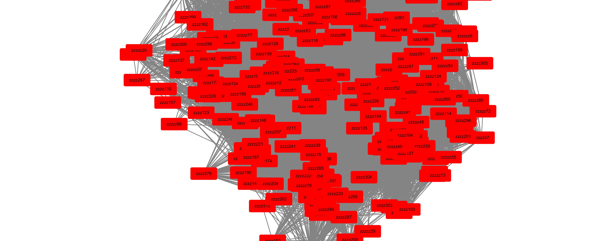
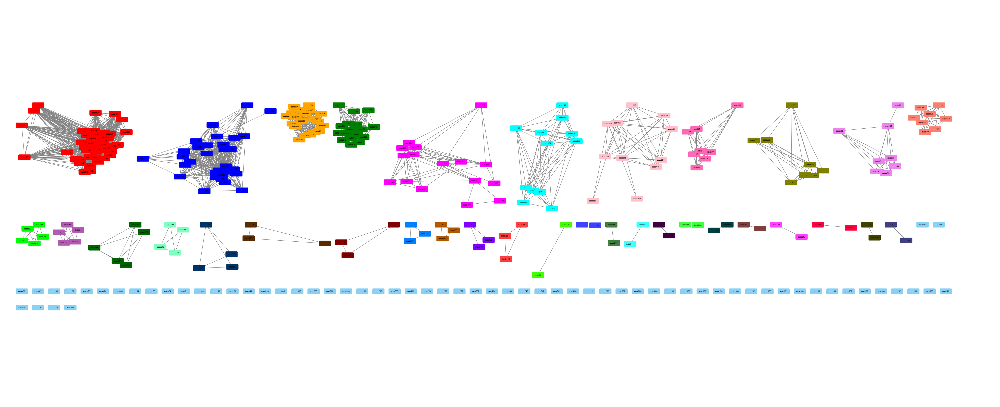
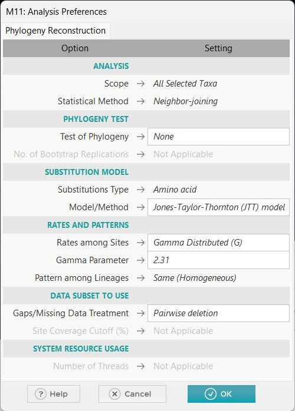
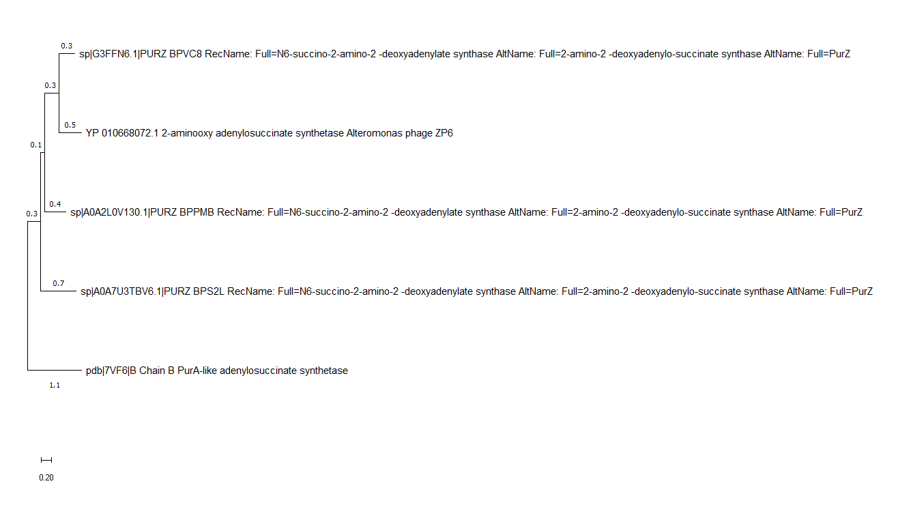

# Project 3

## Task 1

将 NCBI 中找到的序列在 IMG/VR 数据库中进行 blastp，得到 IMG/VR 数据库中相应的序列，并保存为 fasta 格式（共 498 条）。

采用下面这段代码合并所有的序列，并完成去重。

```python
from Bio import SeqIO
from Bio.Seq import Seq
from Bio.SeqRecord import SeqRecord

def merge_and_deduplicate(file1, file2, output_file):
    sequences = {}
    for record in SeqIO.parse(file1, "fasta"):
        seq_str = str(record.seq)
        if seq_str not in sequences:
            sequences[seq_str] = record
    for record in SeqIO.parse(file2, "fasta"):
        seq_str = str(record.seq)
        if seq_str not in sequences:
            sequences[seq_str] = record
    SeqIO.write(sequences.values(), output_file, "fasta")
    return len(sequences)

if __name__ == "__main__":
    ncbi_file = "PurZ0_ncbi.fasta"
    img_file = "PurZ0_img.fasta"
    output_file = "PurZ0_merged.fasta"
    unique_count = merge_and_deduplicate(ncbi_file, img_file, output_file)
    print(f"Found {unique_count} unique sequences")
```

Output:

```
Found 318 unique sequences
```

对去重后的序列文件 `PurZ0_merged.fasta` 构建 SSN，采用 EFI-EST 的方法，使用网站 [Link](https://efi.igb.illinois.edu/efi-est/) 选择 FASTA 项，全部使用默认设置，其中 Initial E-value 为 1e-5

在 Cytoscape 软件中安装 Organic Layout 后打开 SSN coloured 后的 `xgmml` 文件并导入属性表格，使用 `Layout -> Prefuse Force Directed Layout -> alignment_score` 进行展示，结果如下：

E-value: 1e-75



E-value: 1e-120



## Task 2

根据上一问中的结果，选择 E-value 为 1e-120 时更合适的，这个值足够严格，从而可以保证网络中出现代表特定功能的 clusters; 将上一问中 1e-120 对应的 `xgmml` 文件作为输入构建 GNN, 其他使用网站 [Link](https://efi.igb.illinois.edu/efi-gnt/) 的默认设置，进一步得到附件中的两个 `xgmml` 文件: `PurZ0_GNN_evalue75.xgmml` 和 `PurZ0_GNN_evalue120.xgmml`

## Task 3


## Task 4

将合并好的序列文件 `15_seq.fasta` 提交至 MAFFT 网站，选择 strategy L-INS-i，该算法非常适合用于对比差异较大的序列，识别准确率较高。

## Task 5

导入 MEGA 11 Align 后，通过 Find Best Protein Model (ML) ... 的功能，筛选 BIC 值最小的模型作为候选模型，这里的结果是 LG+G 模型，然后使用下图参数构建进化树。



从结果分析，我认为进化源头应该是 PurA 序列


