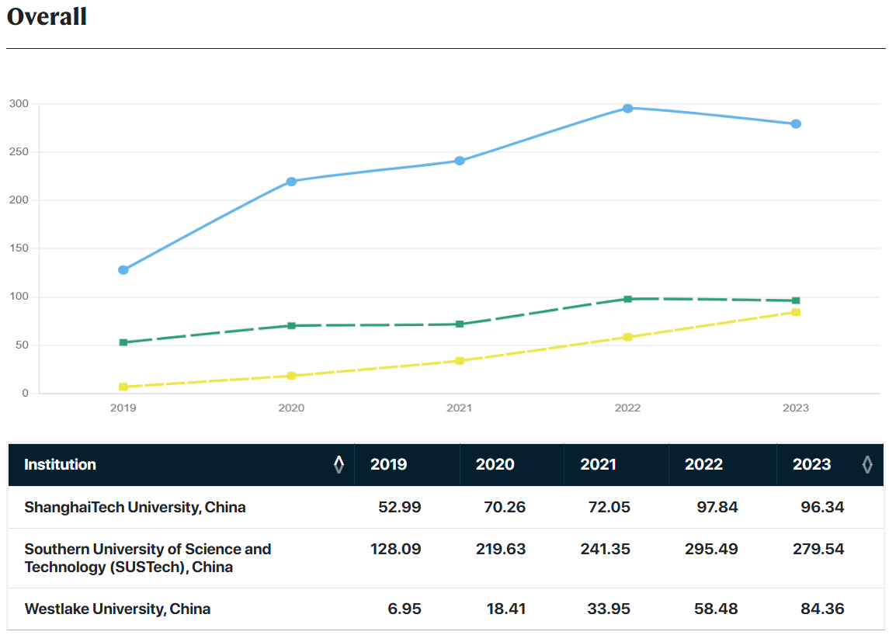
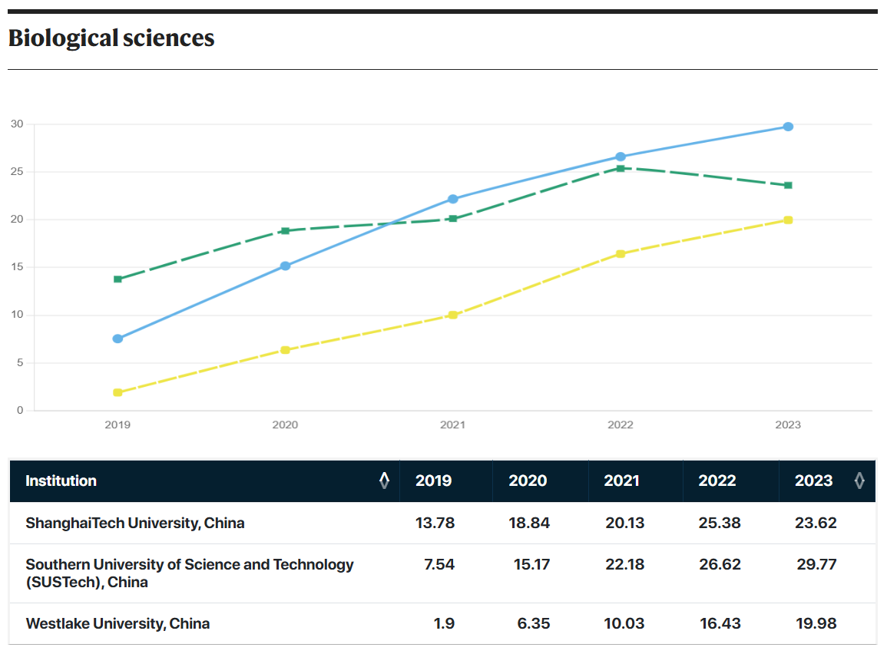

# Computational Biology Homework 3

## Q1

There are 185 results.

The trend shows fluctuating activity with peaks in 2020, 2015, and 2024.

## Q2

[Benchamrk Link](https://www.nature.com/nature-index/institution-research-output?type=share&list=ShanghaiTech+University%2C+China%3BSouthern+University+of+Science+and+Technology+%28SUSTech%29%2C+China%3BWestlake+University%2C+China&list_ids=5289c646140ba0fc05000000%3B513906fc34d6b65e6a001967%3B5a781ee3b9e86b8cec30169d)

1. Overall

2. Biological sciences

Drawback: It only tracks research output from selected natural science journals, excluding many other fields and important publications.

Alternative metric: FWCI

## Q3

|                         Method                          |                                Advantages                                 |                                                          Disadvantages                                                           |
| :-----------------------------------------------------: | :-----------------------------------------------------------------------: | :------------------------------------------------------------------------------------------------------------------------------: |
|                 Number of Publications                  |                   Simple and straightforward to measure                   |                                  Does not account for the quality or impact of the publications                                  |
|                     Citation Count                      |  Indicates the influence and recognition of a researcher's work by peers  | Can be skewed by highly cited papers in unrelated fields Older researchers may have higher citation counts simply due to time |
|                         H-index                         |      Balances productivity (number of papers) and impact (citations)      |                                            Favors researchers with longer careers                                             |
| Does not account the role of the researcher in the work |
|                          FCWI                           |                   Allow cross-disciplinary comparisons                    |                                  May not fully capture the impact of interdisciplinary research                                  |
|                        H5-index                         | Less biased toward senior researchers compared to the traditional h-index |                                   Excludes older publications, which may still be influential                                    |

## Q4

1. Search for review articles and meta-analyses in databases like PubMed, Web of Science, or Google Scholar. Identify highly cited papers and landmark studies.

2. Use tools like Google Scholar or ORCID to find leading researchers. Explore their publications and research groups.

3. Read textbooks, glossaries, or introductory papers to learn the terminology.

4. Focus on a narrow topic within the field and conduct small-scale experiments or literature reviews.
