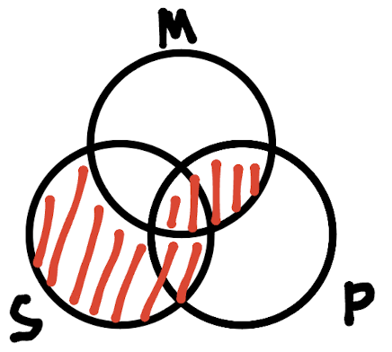
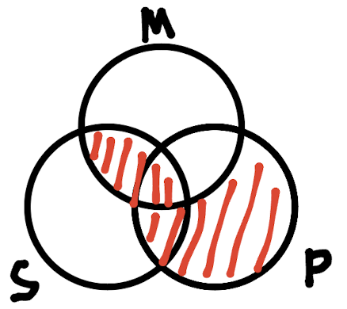
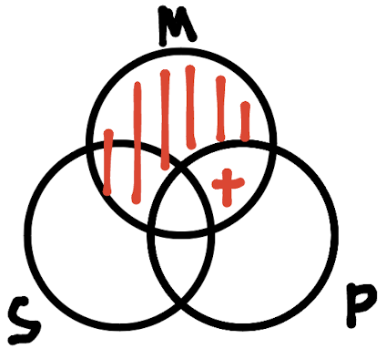
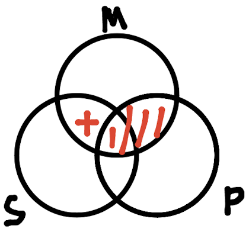

# Homework 2

## 1

1. AOO-1，不正确，大项不当周延
2. EIE-3，小项不当周延
3. AII-3，正确
4. EEA-1，前提中两次否定

## 2

### 2.1

此图表明，当所有的M都不是P并且所有S都是M时，结论“所有S都不是P”一定成立。因此，此三段论是有效的。

### 2.2

此图表明，当所有的P都是M并且所有S都不是M时，结论“所有S都不是P”一定成立。因此，此三段论是有效的。

### 2.3

此图表明，当所有的M都是P并且有些M不是S时，结论“有些S不是P”不一定成立。因此，此三段论不是有效的。

### 2.4

此图表明，当所有的P都不是M并且有些M是S时，结论“有些S不是P”一定成立。因此，此三段论是有效的。

## 3

### 3.1

AOO-2

由于大前提是肯定的，则大前提为A/I；又因为大项在结论中周延，故第一行只能是PAM。  
由于小项在前提中不周延，故小项在结论中也不周延，且大项在结论中周延，因此结论为SOP。  
由于结论为否定，大前提为肯定，所以小前提为E/O；由于大前提中中项不周延，因此小前提中中项必须周延；又因为小项不周延，因此小前提只能是SOM。

### 3.2

AAI-4

由于大项在结论中不周延，故结论是肯定的，因此大前提和小前提都是A/I的。  
由于大项在大前提周延，因此大前提只能是PAM。  
由于大前提中中项没有周延，因此小前提中中项必须周延，小前提只能是MAS。  
由于小前提中小项没有周延，因此结论中小项也没有周延，故结论是SIP。
