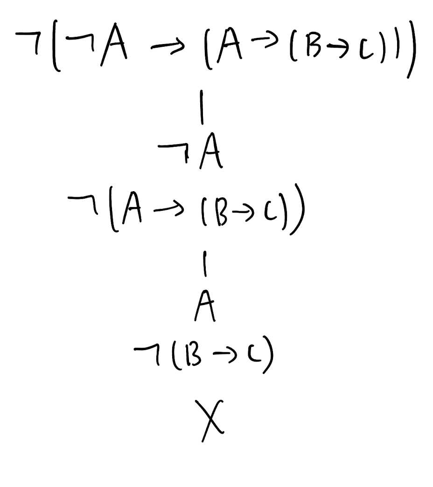
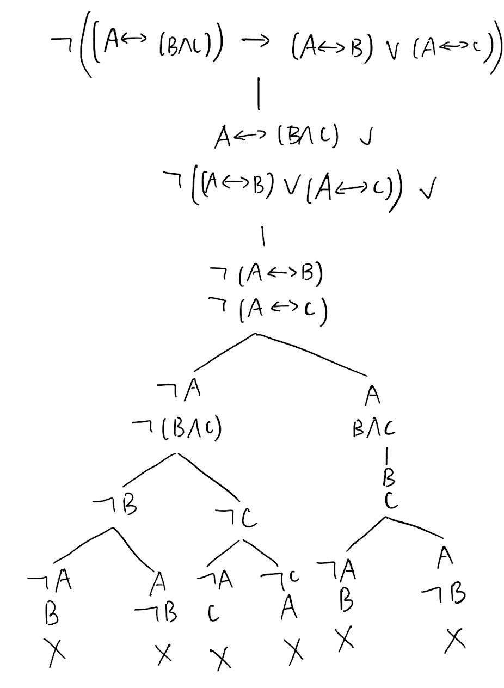

# Homework 3

## Q1

1. $p \rightarrow q$
2. $q \rightarrow p$
3. $\neg p \rightarrow q$
4. $q \rightarrow p$

## Q2

### 2.1

$\mbox{rk}(p \vee q \rightarrow \neg r) = 2$

$\mbox{rk}(p_1 \wedge p_2 \wedge \dots \wedge p_n)= n-1$

$\mbox{rk}(A \rightarrow (B\rightarrow A)) \geq 5$

### 2.2

rank直观上展示了需要进行逻辑运算的次数，表示了公式的结构复杂程度和计算深度；秩越大，则公式更加复杂，需要进行计算的次数越多。

### 2.3

1. $\mbox{len}(A) = 1$
2. $\mbox{len}(\neg B) = \mbox{len}(B)+1$
3. $\mbox{len}(A \wedge B) = \mbox{len}(A) + \mbox{len}(B) + 1$
4. $\mbox{len}(A \vee B) = \mbox{len}(A) + \mbox{len}(B) + 1$
5. $\mbox{len}(A \rightarrow B) = \mbox{len}(A) + \mbox{len}(B) + 1$

## Q3

### 3.1

真值表法:

| A | B | C | $\neg$A | $\neg$ A $\rightarrow$ (A $\rightarrow$ (B $\rightarrow$ C)) | A $\rightarrow$ (B $\rightarrow$ C) | B $\rightarrow$ C |
| :---: | :---: | :---: | :---: | :---: | :---: | :---: |
| 1 |1|1|0|1|1|1|
| 1 |1|0|0|1|0|0|
| 1 |0|1|0|1|1|1|
| 1 |0|0|0|1|1|1|
| 0 |1|1|1|1|1|1|
| 0 |1|0|1|1|1|0|
| 0 |0|1|1|1|1|1|
| 0 |0|0|1|1|1|1|

归谬法:

$\neg$ A $\rightarrow$ (A $\rightarrow$ (B $\rightarrow$ C))

 1      0          0

​    0         1             0	(矛盾)

树形图法:

### 3.2

真值表法:

| A | B | C | B $\wedge$ C | A $\leftrightarrow$ (B $\wedge$ C) | (A $\leftrightarrow$ (B $\wedge$ C)) $\rightarrow$ (A $\leftrightarrow$ B) $\vee$ (A $\leftrightarrow$ C) | (A $\leftrightarrow$ B) $\vee$ (A $\leftrightarrow$ C) | A $\leftrightarrow$ B | A $\leftrightarrow$ C |
| :---: | :---: | :---: | :---: | :---: | :---: | :---: | :---: | :---: |
| 1 |1|1|1|1|1|1|1|1|
| 1 |1|0|0|0|1|1|1|0|
| 1 |0|1|0|0|1|1|0|1|
| 1 |0|0|0|0|1|0|0|0|
| 0 |1|1|1|0|1|0|0|0|
| 0 |1|0|0|1|1|1|0|1|
| 0 |0|1|0|1|1|1|1|0|
| 0 |0|0|0|1|1|1|1|1|

归谬法:

(A $\leftrightarrow$ (B $\wedge$ C)) $\rightarrow$ (A $\leftrightarrow$ B) $\vee$ (A $\leftrightarrow$ C)

​      1                   0                   0

​                                      0                  0

1          1       1          1        0        1        0	(情况1, 矛盾)

0              0               0         1       0        1	(情况2, 矛盾)

树形图法:

